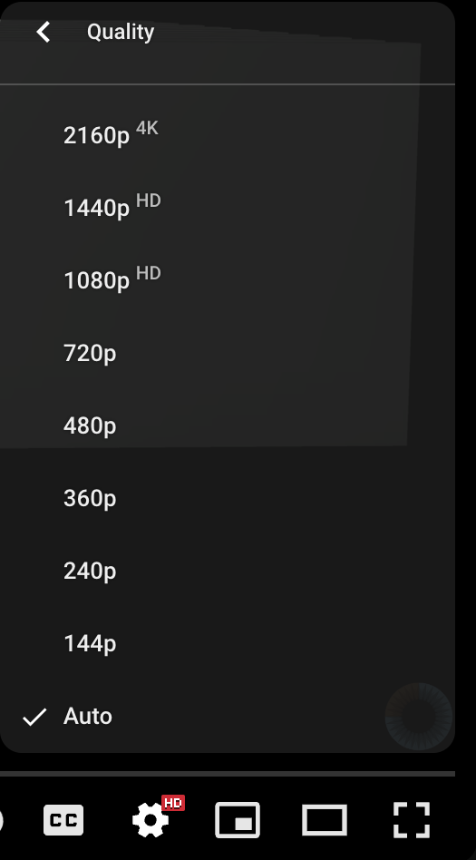
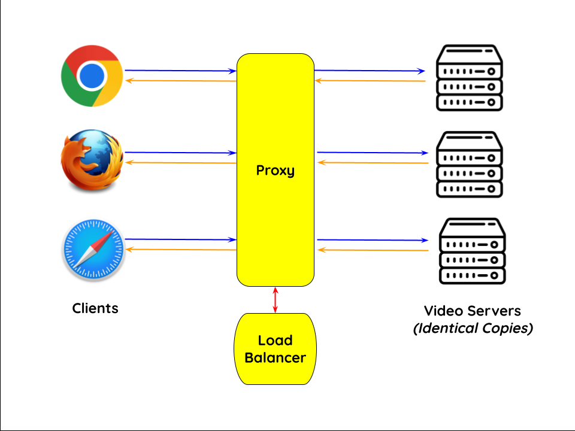
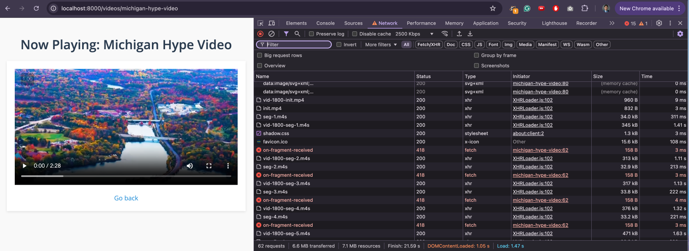
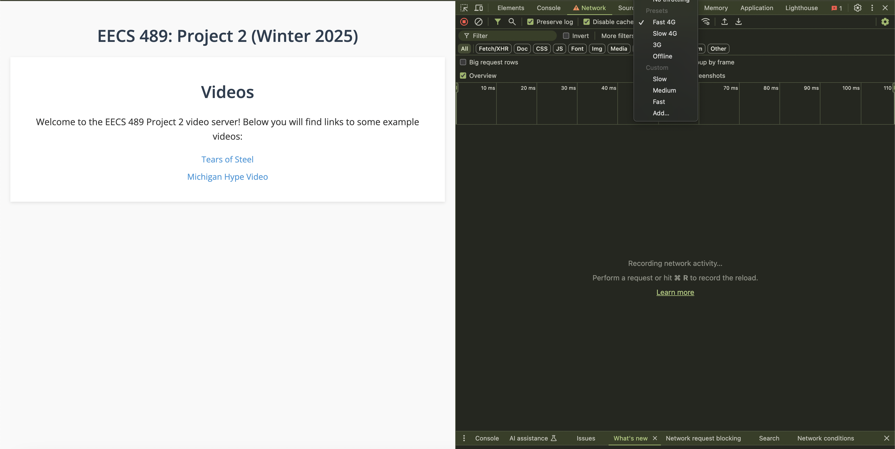
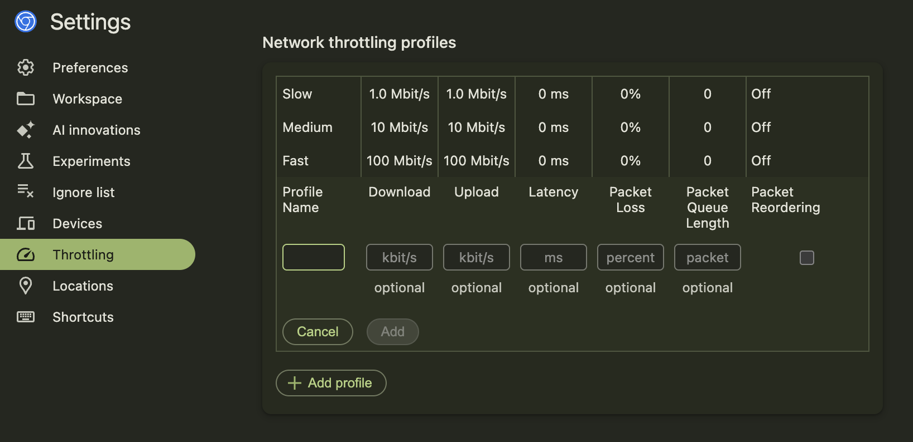

# Assignment 2: Adaptive Video Streaming via CDN

### Due: February 28th, 2025 @ 11:59 PM

Video traffic dominates the Internet. In this project, you will explore how video content distribution networks (CDNs) work. In particular, you will implement (1) adaptive bitrate selection through an HTTP proxy server and (2) load balancing. 

This project is divided into Part 1 and Part 2. We recommend that you work on them simultaneously (both of them can be independently tested), and finally integrate both parts together. This is a group project; you may work in groups of up to three people. 

This project has the following goals:
 - Understand the HTTP protocol and how it is used in practice to fetch data from the web. 
 - Understand the DASH MPEG video protocol and how it enables adaptive bitrate video streaming. 
 - Use polling to implement a server capable of handling multiple simultaneous client connections. 
 - Understand how Video CDNs work in real life. 

## Table of contents
1. [Background](#background)
2. [Getting Started](#getting-started)
3. [Part 1: HTTP Proxy](#part-1-http-proxy)
4. [Part 2: Load Balancer](#part-2-load-balancer)
5. [Autograder](#autograder)

## Background

### Video CDNs in the Real World


The figure above depicts a high level view of what this system looks like in the real world. Clients trying to stream a video first issue a DNS query to resolve the service's domain name to an IP address for one of the CDN's proxies. The CDN's authoritative DNS server selects the “best” content server for each particular proxy based on
(1) the proxy's IP address (from which it learns the proxy's geographic location) and
(2) current load on the content servers (which the servers periodically report to the DNS server).

Once the client has the IP address for one of the content servers, it begins requesting chunks of the video the user requested. The video is encoded at multiple bitrates. As the client player receives video data, it calculates the throughput of the transfer and it requests the highest bitrate the connection can support (i.e. play a video smoothly, without buffering if possible). For instance, you have almost certainly used a system like this when using the default "Auto" quality option on YouTube:




### Video CDN in this Assignment

Normally, the video player clients select the bitrate of the video segments they request based on the throughput of the connection. However, in this assignment, you will be implementing this functionality on the server side. The server will estimate the throughput of the connection with each client and select a bitrate it deems appropriate.



You'll write the components highlighted in yellow in the diagram above (the proxy and the load balancer). 

**Clients:** You can use an off-the-shelf web browser (Firefox, Chrome, etc.) to play videos served by your CDN (via your proxy). You can simulate multiple clients by opening multiple tabs of the web browser and accessing the same video, or even using multiple browsers. You will use network throttling options in your browser to simulate different network conditions (available in both Firefox and Chrome).

**Video Server(s):** Video content will be served from our custom video server; instructions for running it are included below. With the included instructions, you can run multiple instances of video servers as well on different ports. 

**Proxy:** Rather than modify the video player itself, you will implement adaptive bitrate selection in an HTTP proxy. The player requests chunks with standard HTTP GET requests; your proxy will intercept these and modify them to retrieve whichever bitrate your algorithm deems appropriate, returning them back to the client. Your proxy will be capable of handling multiple clients simultaneously. 

**Load Balancer:** You will implement a simple load balancer that can assign clients to video servers either geographically or using a simple round-robin method. This load balancer is a stand-in for a DNS server; as we are not running a DNS protocol, we will refer to it as a load balancer. The load balancer will read in information about the various video servers from a file when it is created; it will not communicate with the video servers themselves. 

After you implement the basics of the [HTTP Proxy](#part-1-http-proxy) and the [Load Balancer](#part-2-load-balancer), you will integrate the two together. The proxy can query the load balancer every time a new client connects to figure out which video server to connect to. 

### Important: IPs and Ports
In the real world, IP Addresses disambiguate machines. Typically, a given service runs on a predetermined port on a machine. For instance, HTTP web servers typically use port 80, while HTTPS servers use port 443. 

For the purposes of this project, as we want you to be able to run everything locally, we will instead distinguish different video servers by their (ip, port) tuple. For instance, you may have two video servers running on (localhost, 8000) and (localhost, 8001). We want to emphasize that this would not make much sense in the real world; you would probably use a DNS server for load balancing, which would point to several IPs where video servers are hosted, each using the same port for a specific service.

## Getting Started 
This project has been adapted so that it can be run and tested on your own device, without any need for a virtual machine. Although this leads to a slightly less realism, we hope it makes development faster and easier. Feel free to use your VM from Project 1 to run your code in Mininet for the full experience. 

> Note: The only configuration that cannot be tested locally is running a geographic load balancer in conjunction with a load-balancing miProxy. This will have to occur on Mininet. However, you are able to locally test both (1) miProxy with a round-robin load balancer and (2) a geographic load balancer on its own. 

To get started, clone this Github repository. You can then create your own  **private** GitHub repository, and push these files to that repo. Your repository should be shared only with your group members, and should not be publicly accessible. **Making your solution code publicly accessible, even by accident, will be considered a violation of the Honor Code.** 

The structure of the files is as follows:
```
├── README.md
├── cpp
│   ├── CMakeLists.txt
│   └── src
│       ├── CMakeLists.txt
│       ├── common
│       │   ├── loadBalancerProtocol.h
│       │   ├── networkUtils.cpp
│       │   └── networkUtils.h
│       ├── loadBalancer
│       │   └── CMakeLists.txt
│       └── miProxy
│           └── CMakeLists.txt
├── img/...
├── sample_geography.txt
├── sample_round_robin.txt
├── util
│   └── queryLoadBalancer
└── videoserver
|   ├── launch_videoservers.py
|   └── ...
```
### Your Code
As in Project 1, we will be using CMake as our build system. The top-level CMake file is at `cpp/CMakeLists.txt`. There are also `CMakeLists.txt` files in every subdirectory. These files have been filled out for you. We encourage you to take a look and see how they work. You may need to modify them if the structure of your code changes. You **may not** use any external packages other than the ones we provide: `spdlog`, `cxxopts`, `pugixml`, and `boost::regex`.

We have also included a `common` folder with a few network utility functions (these are copied over from the Discussion 3 example) as well as the protocol definition for communicating with the load balancer. You can (and should!) add more network utility functions and other code that can be shared between `miProxy` and `loadBalancer` into the common folder. 

The structure of the project is otherwise self-explanatory; your implementation for `miProxy` should go in the `miProxy` folder, and your implementation of the `loadBalancer` should go in the `loadBalancer` folder. The following commands should allow us to build your code from the base of the project:
```bash
$ mkdir build
$ cd build
$ cmake ../cpp
$ make
```
This should result in executables `build/bin/miProxy` and `build/bin/loadBalancer`.  

We also encourage you to integrate CMake with your editor. For instance, VSCode has a CMakeTools extension. This enables VSCode's intellisense to properly find code dependencies, which can eliminate annoying fake syntax errors. There are many resources online for you to figure out how to do this. 

The two parts of the project can each be tested on their own before the integrated version is tested. You may wish to parallelize work among your groupmates; feel free to do so, but please remember that all individuals are responsible for understanding the entire project. 

### Running the Video Server
We have provided a simple video server for you, implemented in the `videoserver/` directory. First, you will need to download and unzip some of the video files.

We are using `git-lfs` (Git Large File Storage) to store the video files in the Git repo. Follow the instructions [here](https://docs.github.com/en/repositories/working-with-files/managing-large-files/installing-git-large-file-storage) to install `git-lfs` on your machine. Once you have installed `git-lfs`, you can run the following commands to download the video files. 

```bash
$ git lfs install
$ git lfs pull
```

We have provided a simple video server for you, implemented in the `videoserver/` directory. First, you will need to unzip some of the video files:
```bash
$ cd videoserver/static/videos
$ tar -xvzf michigan-hype-video.tar.gz
$ tar -xvzf tears-of-steel.tar.gz
```
This should lead to two folders -- `michigan-hype-video` and `tears-of-steel` -- being created inside the `videos/` folder. 

For Python, we will be using the [uv package manager](https://github.com/astral-sh/uv). Please follow the instructions on the linked Github page to install uv on your machine. 

Once you have installed uv, you can navigate to the `videoserver/` directory and run 
```bash
uv sync
```
This will download all necessary Python dependencies and create a virtual environment. You can then run 
```bash
uv run launch_videoservers.py 
``` 
to launch videoservers. This takes the following command line arguments
* `-n | --num-servers`: Defaults to 1. Controls how many video servers will be launched. 
* `-p | --port`: Defaults to 8000. Controls which port the video server(s) will serve on. For multiple videoservers, the ports will be sequential; for instance, running the following command will launch three videoservers on ports 8000, 8001, and 8002. 
```bash
uv run launch_videoservers.py -n 3 -p 8000
```
> Note: It is not necessary to have multiple videoservers running for the early part of this project. You will only really need this if you want to test how well your `miProxy` works with load balancing and separating multiple clients. 

Once you launch a videoserver (e.g. on port 8000), you can navigate to `127.0.0.1:8000` (or `localhost:8000`) in your browser to see it. It will look something like this:


You can click on the linked pages to play the videos. The first one (Tears of Steel) does not have audio, while the second one (Michigan Hype Video) does; this can help vary your testing. The Tears of Steel video also has watermarks to indicate the bitrate of the current segment. The video server will also log helpful output to stdout that can help you debug. 

Note that you are currently directly accessing the video server; when testing this project, you will instead navigate to the `ip:port` of your running proxy, which will communicate with the video server for you. 

### Libraries
As in Project 1, we expect you to use `cxxopts` for parsing command-line options, and `spdlog` for variable-level logging. We will require certain logs to be printed using `spdlog` from both the HTTP proxy and the load balancer in order to faciliate autograding and debugging. 

We have also included `pugixml`, a [C++ XML-parsing library](https://pugixml.org/) and the `boost::regex` library in the CMake files. You do not have to use these libraries, but it will make parsing video manifest files and HTTP requests much easier. Documentation for these libraries is available online. 

> Why not use #include \<regex\>? The C++ standard library's regex header is widely known to be slow and inefficient. This means that you will instead see packages like `re2` or `boost` used in production code.

You may have to install Boost on your system. If you are on a Mac, this is very easy. Simply use Homebrew and run

```bash
brew install cmake boost
```
and you're done and ready to skip to "Setting Up the Starter Code".

On Windows or Linux, installing CMake and Boost are also relatively simple. On Ubuntu / WSL, you can run
```bash
sudo apt-get install cmake libboost-all-dev
```

## Part 1: HTTP Proxy

Many video players monitor how quickly they receive data from the server and use this throughput value to request better or lower quality encodings of the video, aiming to stream the highest quality encoding that the connection can handle. Instead of modifying an existing video client to perform bitrate adaptation, you will implement this functionality in an HTTP proxy through which your browser will direct requests.

You are to implement a simple HTTP proxy, `miProxy`. It accepts connections from web browsers, modifies video chunk requests as described below, opens a connection with the resulting IP address, and forwards the modified request to the server. Any data (the video chunks) returned by the server should be forwarded, *unmodified*, to the browser. `miProxy` should:

1. Run as a server on a specified port
2. Accept connections from clients, including multiple clients simultaneously
3. Connect to a video server
4. Forward HTTP requests from clients to the appropriate video server
5. Forward HTTP responses from the video server to the appropriate client
6. Measure the throughput of each video segment to each client
7. Capture video manifest file HTTP requests, returning the no-list manifest file to clients while reqeuesting the regular manifest file for itself
8. Capture video segment HTTP requests and modify the request to have the appropriate bitrate

You will implement two modes of miProxy: 
1. No load balancing occurs, with a single video server for all clients. 
2. A load balanced version, where miProxy queries your load balancer (implemented in Part 2) to figure out which video server to assign to each incoming TCP connection. 

### Clients vs. Incoming Sockets
For optimization, web browsers may open up several TCP connections for a single tab; this can lead to multiple sockets connecting to your `miProxy` server for a single client. We will use the term "client socket" to refer to an individual socket and "client" to refer to a group of sockets of a single tab that form one logical client. 

### Handling Clients 

In Discussion 3, we will cover an example of using **select polling** to handle multiple incoming client sockets. You should watch the Discussion 3 recording, go over the slides, and look through the example code [here](https://github.com/mosharaf/eecs489/tree/w25/Discussion/ds3-echoserver). `miProxy` should handle multiple client sockets in much the same way. 

> Note: Feel free to copy/adapt code that we give you. You should understand any code that you put into your project; `select()` is rather unintuitive and you will encounter nasty bugs if you use it without understanding it. 

Clients will connect to `miProxy` over TCP. When a new client socket connects to `miProxy`, `miProxy` should 
1. [In load balancing mode] Send a request to the load balancer to figure out which video server to use for this client. 
2. [In either mode] Open up a corresponding connection to the videoserver. 

For ease of implementation, we recommend that you use exactly one connection between the proxy and a videoserver for each connection between a client socket and the proxy. A connected client socket should use the same videoserver for the duration of its connection (note: client socket, not client). We define a new connection in this case as whenever a call to `accept()` occurs in the proxy. 

Once a client is connected to `miProxy`, it will begin sending HTTP 1.1 requests. These requests may include `GET`, `POST`, and any number of other requests. A request from the client to `miProxy` will fall within one of four categories:
1. A GET request for a video manifest (`.mpd`) file. 
1. A GET request for a **video** segment (`.m4s`) file.
1. A POST request to `/on-fragment-received` with information about a segment that the client has finished receiving.
1. All other requests.

We discuss the first three categories below in further detail. Any request that falls into the fourth category should be forwarded as-is to the appropriate video server, without any modifications. The video server will send HTTP 1.1 responses to these requests. **All responses from the video server should be forwarded without modification to the corresponding client.**

Within your client-serving loop, you may wonder about how much work you should do for a single client before moving on to the next one. To be efficient, we require that you only handle a single HTTP request from a client at a time before moving on. In other words, your code should look something like:
```
while (true)
	select(...)
	...
	if (client socket is ready)
		receive request from client
		deal with single request (e.g forwarding to webserver, updating throughput, etc.)
		move on
```
Your code should NOT look like:
```
while (true)
	select(...)
	...
	if (client socket is ready)
		receive request from client
		forward to webserver
		receive webserver response
		forward to client 
		receive client "on-fragment-received"
		move on
```

### Handling Client Requests

When arriving on a page with a video (e.g. `/videos/tears-of-steel`), the client will first attempt to request a `vid.mpd` file (e.g `GET /videos/tears-of-steel/vid.mpd`). This is a manifest file that contains information about which bitrates are available. Examples of this file are in the starter code at `videoserver/static/videos/*/vid.mpd`. 

Any HTTP request that asks for a `.mpd` file should be flagged as a manifest file request. Your proxy should instead request the corresponding `vid-no-list.mpd` file to forward back to the browser. Furthermore, your proxy should request the original `vid.mpd` manifest file for itself so that the proxy can figure out which bitrates are available for a given video. The manifest file is an `XML` file -- you should use `pugixml` to simplify parsing it. You will notice that several `<Representation>` rows exist within this file. The important part of each row is the `bandwidth` field, which specifies the available bandwidths **in Kbps**. You should only parse the representation rows for the `video` section, ignoring the `audio` section (see the `.mpd` file under `michigan-hype-video`). 

Your proxy **should** store available bitrates for each video somewhere that persists across connections. You can uniquely identify a video by the path to its `.mpd` file. In other words, only the first-ever request for the manifest file of a particular video should trigger a request for the regular manifest file AND the `no-list` manifest file. All subsequent requests should only lead to a request for the `no-list` file. 

Once the client parses the manifest file, it begins requesting video segment files. You should check that a request is for a **video** segment file by checking that the path falls within the `video` folder of the filepath to the `.mpd`, and that the file extension is `.m4s`. For simplicity, you may assume that the video segment requests paths are all in the form:

`[PATH-TO-VIDEO]/video/vid-[BITRATE]-seg-[NUMBER].m4s`

> Note: You may see requests for audio files (also ending with .m4s) and an init.mp4 file. These should not be treated as video segment requests. 

For any incoming video segment request from a client socket, your proxy should replace the `[BITRATE]` of the requested segment with the appropriate `[BITRATE]` (chosen from the available bitrates in the `.mpd` file and based on your throughput calculations) before forwarding it to the video server. We will discuss how to determine the appropriate bitrate below. 

Once you receive a response from the videoserver and forward it to a client, the client will reply with a POST request to the endpoint `/on-fragment-received`. This will contain information within the headers that will be useful for your throughput calculation. Your proxy should use this request to update the throughput for that particular client (note: not client socket) and should not forward this request to a videoserver. 

In summary, the flow for a segment request works as follows:

1. The proxy receives a request for a video segment from a client.
1. Using the currently calculated throughput for that client, the proxy modifies the request to request the segment at the appropriate bitrate.
1. The proxy forwards the request to the video server.
1. The video server sends the segment back to the proxy.
1. The proxy forwards the segment to the client.
1. Once the client fully receives the segment, it sends a POST request to `/on-fragment-received` with some throughput-related information. 
1. The proxy uses this information to update the measured throughput of that client. 

#### Seeing It In Action

In most browsers, it is very easy to view HTTP request-responses. For instance, in Chrome, you can do Right Click --> Inspect Element, and then click on the Network tab to view this information. You can click on each request to view its headers and raw data. This can be very helpful to understand what is happening with these requests, and debug the performance of your proxy. 



You will notice that the `on-fragment-received` requests return an error code from the videoserver; this is because your proxy should intercept them and the videoserver should never see them. 

> Bonus: Click on one of the network requests with error code 418 for a surprise; what does your browser interpret the error code as? You can read more about that [here](https://en.wikipedia.org/wiki/Hyper_Text_Coffee_Pot_Control_Protocol). 

### Parsing HTTP 1.1 Headers

In HTTP 1.1, persistent connections are enabled by default. This means that the connection between the client and the proxy will remain open after the response is sent, allowing for multiple requests and responses to be sent over the same connection.

In order to handle persistent connections, all requests and responses must include a `Content-Length` header. This header specifies the length of the message body in (bytes). The `Content-Length` header is used to determine when the message body has been fully received. If there is no message body following the headers, the `Content-Length` header will be set to 0.

This implies that HTTP packets have an unknown length; as such, it is difficult to parse them all-at-once, as you do not know how much of a buffer to allocate to store the data. To deal with this, you should parse HTTP packets byte-by-byte until you reach the end of the HTTP header. This will be demarcated by the four-byte sequence `\r\n\r\n`. Once you read this sequence, you can use the `Content-Length` header to figure out how much more data there is. Using something like `recv()` into a large fixed buffer may fail in case there are multiple requests awaiting to be read. 

Additionally, when parsing headers, make sure that you parse them in a case **in**sensitive way. This is the correct way to parse headers per the RFC, and this will probably end up getting tested by virtue of different browsers sending headers in different cases. This means that `Content-Length` and `ConTEnT-lEngTh` should be treated as the same header, for instance.

### Calculating Throughput

Your proxy measures the the throughput between each client and itself to determine the bitrate on a per-client basis. Your proxy should estimate each stream's throughput once per video segment. Because sockets hide the underlying network details, we rely on the client to send application level messages indicating when it started and stopped finishing receiving each segment. 

Throughput must be calculated independently on a per-client basis. To help you uniquely identify a client, each segment-related request from a client will include a `X-489-UUID` header in the HTTP headers. This is the **only** piece of information that you should use to disambiguate clients. As mentioned earlier, multiple client sockets may originate from the same client. Although not all requests will have this header, the following requests are guaranteed to contain it:
- GET requests for a video segment
- POST requests to `/on-fragment-received`

The throughput calculation is a much simpler one than in Project 1; we ignore any propagation delay, and simply calculate: 

$$\text{Throughput} = \frac{\text{Data Size}}{\text{Elapsed Time}}$$ 

As mentioned earlier, throughput should be updated whenever a POST request for the endpoint `/on-fragment-received` arrives. Your proxy should **not** forward these requests to the video server, and instead should simply respond with a HTTP `200 OK` status code. The `/on-fragment-received` request will include the following headers (among others):

```
x-489-uuid: db861416-d7c5-49f1-9803-519364dd2b3b
x-fragment-size: 344912				// in bytes
x-timestamp-start: 1738472727213	// in milliseconds since Unix epoch
x-timestamp-end: 1738472728625		// in milliseconds since Unix epoch
```

These can be used to estimate the throughput for a single segment. To smooth your overall throughput estimation while adapting to changing network conditions, you should use an exponentially-weighted moving average (EWMA). Every time you make a new measurement (for a new video segment), update your current throughput estimate as follows:

$$T_\text{cur} = \alpha * T_\text{new} + (1 - \alpha) * T_\text{cur}$$

The constant $0 \leq \alpha ≤ 1$ controls the tradeoff between a smooth throughput estimate (`alpha` closer to 0) and one that reacts quickly to changes (`alpha` closer to 1). You will control `alpha` via a command line argument. **When calculating the throughput for a client, initialize `T_cur` to zero for the first update**.

### Choosing a Bitrate
Once your proxy has calculated the connection's current throughput, it should select the highest offered bitrate the connection can support. For this project, we say a connection can support a bitrate if the average throughput is at least 1.5 times the bitrate. For example, before your proxy should request chunks encoded at 1000 Kbps, its current throughput estimate should be at least 1500 Kbps (1.5 Mbps).

As described earlier, your proxy will replace each video segment request with a request for the same segment at the selected bitrate (in Kbps) by modifying the HTTP request’s `Request-URI`. For instance, a client may request 

`/videos/tears-of-steel/video/vid-500-seg-2.m4s`

If your estimated average throughput at this point is, say, 1300 Kbps, you should replace the URI with

`/videos/tears-of-steel/video/vid-800-seg-2.m4s`

This is because the highest bitrate the video is available at that is lower than 1300 / 1.5 = 866 Kbps is 800 Kbps. If none of the available bitrates satisfy your current throughput estimate, you should default to selecting the lowest one. 

### Design Considerations
These are included in other places, but bear repeating here:

* You should have exactly one TCP connection between the proxy and a videoserver for every TCP connection between a client and the proxy. When a client closes a connection, your proxy should close the corresponding connecton to the videoserver. 
* Your proxy **should** store available bitrates for each video somewhere that persists across connections. You can uniquely identify a video by the path to its `.mpd` file. In other words, only the first-ever request for the manifest file of a particular video should trigger a request for the regular manifest file AND the `no-list` manifest file. All subsequent requests should only lead to a request for the `no-list` file. 
* Your proxy **should not** perform any other caching. All client requests (except POST requests to `/on-fragment-received`) should always lead to a corresponding request to the videoserver. 
* For throughput calculation, you should uniquely identify a client by the `X-489-UUID` header within the GET request. This is because, for optimization, web browsers may open up several TCP connections for a single tab. This UUID should be the ONLY piece of data that you use to separate throughput estimates. Note that, although not all requests will have this header, any GET requests for a video segment will. 

### Logging 
`miProxy` should use `spdlog` to print certain logs to the command line. For convenience, we've copy-pasted what these logs should look like below:
#### When `miProxy` is ready and listening for connections:
```cpp
spdlog::info("miProxy started");
```
#### When a new socket connects:
```cpp
spdlog::info("New client socket connected with {}:{} on sockfd {}", client_ip, client_port, sockfd); 
```
The client_ip should be a string like `127.0.0.1`. The client port should be the port being used by the client on the client's machine. The sockfd should be the socket returned by `accept()` in `miProxy`. 

#### When a client socket disconnects:
```cpp
spdlog::info("Client socket sockfd {} disconnected", sockfd); 
```
#### When a video manifest file request occurs:
```cpp
spdlog::info("Manifest requested by {} forwarded to {}:{} for {}", client_uuid, videoserver_ip, videoserver_port, chunkname); 
```
For instance, `Manifest requested by 880e8e87-d503-43a1-ba6e-1fc06da4aaa2 forwarded to 127.0.0.1:8000 for /videos/tears-of-steel/vid-no-list.mpd`. 

#### When a video segment (.m4s) file request/response occurs:
```cpp
spdlog::info("Segment requested by {} forwarded to {}:{} as {} at bitrate {} Kbps", client_uuid, videoserver_ip, videoserver_port, chunkname, bitrate); 
```

#### When a POST request to `/on-fragment-received` occurs:
```cpp
spdlog::info("Client {} finished receiving a segment of size {} bytes in {} ms. Throughput: {} Kbps. Avg Throughput: {} Kbps", client_uuid, segment_size, segment_duration, tput, avg_tput); 
```

This log should be printed **after** the client makes the `POST` request to `/on-fragment-received`.

* `client_ip` IP address of the socket issuing the request to the proxy.
* `client_port` Port of the socket issuing the request to the proxy.
* `client_uuid` The UUID of the client that is making the request.
* `videoserver_ip` IP address of the videoserver to which the request was forwarded. 
* `videoserver_port` Port of the videoserver to which the request was forwarded. 
* `chunkname` The name of the file your proxy requested from the web server (that is, the modified file name in the modified HTTP GET message).
* `bitrate` The bitrate requested by your proxy for that segment. This should be an integer number. 
* `segment_size` An integer representing the size of a segment in bytes. 
* `segment_duration` An integer representing the number of milliseconds it took to download a segment from the proxy to the client. 
* `tput` The throughput you measured for the current chunk in Kbps (rounded down to an integer). 
* `avg_tput` Your current EWMA throughput estimate in Kbps (rounded down to an integer). 

These are **the only logs** you should print at the info level. You may use the error and debug levels freely to print additional information. 

### Running `miProxy`
To operate `miProxy`, it should be invoked in one of two ways:

#### Method 1: No load balancing with a single video server. 

This mode of operation will be for testing your proxy without a working DNS server from part 2.

```
./miProxy -l 9000 -h 127.0.0.1 -p 8000 -a 0.5 
```

* `-l | --listen-port`: The TCP port your proxy should listen on for accepting connections from your browser.
* `-h | --hostname`: Argument specifying the IP address of the video server from which the proxy should request video chunks. 
* `-p | --port`: Argument specifying the port of the video server at the IP address described by `hostname`. 
* `-a | --alpha`: A float in the range [0, 1]. Uses this as the coefficient in your EWMA throughput estimate.

#### Method 2: Load balancing functionality

In this mode of operation your proxy should obtain a video server IP for each new client connection by sending a request to the load balancer. 

```
./miProxy -b -l 9000 -h 127.0.0.1 -p 8000 -a 0.5 
```
* `-b | --balance`: The presence of this flag indicates that load balancing should occur. 
* `-l | --listen-port`: The TCP port your proxy should listen on for accepting connections from your browser.
* `-h | --hostname`: Argument specifying the IP address of the **load balancer**. 
* `-p | --port`: Argument specifying the port of the load balancer at the IP address described by `hostname`. 
* `-a | --alpha`: A float in the range [0, 1]. Uses this as the coefficient in your EWMA throughput estimate.

Note that the interpretation of the `hostname` and `port` arguments has changed to be the hostname and port of the load balancer rather than the video server. 
To test in this mode, you should first spin up a videoserver, then the load balancer, then the miproxy, and finally, a browser. 

#### Error checking

You should exit with a non-zero error code (and print a helpful message on the command-line) if any of the following occur:
* Any of the four required arguments are not specified
* Either of the ports are not in the range [1024, 65535]
* The alpha value is not in the range [0, 1]

### Testing
To play a video through your proxy, you launch an instance of the video server, launch a web browser, and point the browser on the URL `http://<proxy_ip_addr>:<listen-port>/index.html`.

A good first step is ensuring that your proxy can simply forward requests in both directions between the client and web browser without making any modifications. Once you have that working, you can begin trying to modify the chunks. You can incrementally test your project in this order, making sure that you can accomplish all previous steps before moving onto the next:

1. Accept connections from **multiple clients**
2. Connect to one of the video servers
3. Forward HTTP requests from clients
4. Wait and forward HTTP responses from video servers
5. Measure the throughput of each video segment
6. Capture video manifest file HTTP requests, send a manifest request to web server, and send another request to return a no list manifest file to client 
7. Capture video segment HTTP requests and modify the request according to measured throughputs 
8. Be able to connect to the load balacner and parse a response

When testing `miProxy` as a whole, you should test it under these scenarios progressively: 

1. No load balancer, single client
2. No load balancer, multiple clients 
3. Load balancer, single client
4. Load balancer, multiple clients

#### Modifying Bandwidth

You will want to test your proxy with different bandwidths to ensure that it is correctly selecting the appropriate bitrate.

Browsers including Google Chrome and Firefox provide tools to throttle network speeds. In Chrome, you can access this by opening the developer tools (Right Click --> Inspect Element) and clicking on the Network tab. Here, you will see a dropdown menu that allows you to throttle network speeds.




Firefox has equivalent functionality in the Network tab of the developer tools. You should set up several throttling profiles; note that Chrome allows for each tab to use different throttling conditions. Your throttlers should all have a latency of 0. **Remember to turn off throttling when you pause working on this project in order to not affect your normal web browsing.**

### Helpful Tips (Read these for your own sake!)

- **Please** write a bare-bones HTTP parser. There are a lot of headers that you will need to access, and I guarantee you that you will have some small error that will be a nightmare to debug if you try to do this in a less structured way.
	- It's helpful to have a class that represents an HTTP request, and a class that represents an HTTP response. It's nice to have them share methods, such as one that parses header fields into a easy-to-access map.
- Use `std::stoi` and `std::stoll` instead of `atoi` and `atol`. The former will throw exceptions if the string is not a valid number, while the latter will not. There is almost always one team that uses the latter without explicit error checking and ends up with some weird bug. Save yourself the headache.
- Encapsulation, encapsulation, encapsulation. You will have a lot of state that you need to keep track of. If you try to do this all with a single class (or even worse, all in `main`), you will be very unhappy. Make lots of functions to encapsulate different parts of the proxy.

## Part 2: Load Balancer

To spread the load of serving videos among a group of servers, most CDNs perform some kind of load balancing. A common technique is to configure the CDN's authoritative DNS server to resolve a single domain name to one out of a set of IP addresses belonging to replicated content servers. The DNS server can use various strategies to spread the load, e.g., round-robin, shortest geographic distance, or current server load (which requires servers to periodically report their statuses to the DNS server). 

In this part, you will write a simple load balancing server, `loadBalancer`, that implements load balancing in two different ways: round-robin and geographic distance. As mentioned earlier, we will not implement a DNS server in order to run videoservers locally, as your load balancer will need to specify both an IP address and a port. 

### Protocol 
The protocol used by the load balancer is defined in `cpp/src/common/loadBalancerProtocol.h`. `miProxy` should send a `LoadBalancerRequest`, and the load balancer should respond with a `LoadBalancerResponse`. 

Remember to use byte order conversion functions (i.e. `ntohl`, `htonl`, `ntohs`, `htons`) when sending/receiving integers over the network! The port and request ID are both interpreted as integers; the IP address is not. Please see Discussion 1 materials for why these are important. 

### Round-Robin Load Balancer
One of the ways you will implement the load balancer is as a simple round-robin load balancer. It will take a file containing a list of videoserver IP addresses and ports on the command line. Beginning at the start of the list, the load balancer will return the next IP address in the list for each subsequent request, looping back to the top of the list when it reaches the end. 

An example of the input file format is in `sample_round_robin.txt`:
```
NUM_SERVERS: 3
127.0.0.1 8000  
127.0.0.1 8001
127.0.0.1 8002
```

### Geographic Distance Load Balancer
Next you’ll make your load balancer somewhat more sophisticated. Your load balancer must return the closest video server to the client based on the client IP address included in the request. In the real world, this would be done by querying a database mapping IP prefixes to geographic locations. For your implementation, however, you will be given information in a text file about the entire state of the network, and your server will have to return the closest geographic server to a client. 

> Note: You may question how useful it is to return a closest server when all requests are going through the proxy anyway. You would be absolutely right about this, but you can easily imagine a scenario where the load balancer is actually a DNS server, and the bitrate adaptation behavior of the proxy occurs in the browser itself. 

The text file will be represented in the following way:
```
NUM_NODES: <number of hosts and switches in the network>
<host_id> <CLIENT|SWITCH|SERVER> <IP address|NO_IP>
[Repeats for a total of NUM_NODES rows, including the one above this]
NUM_LINKS: <number of links in the network>
<origin_id> <destination_id> <cost>
[Repeats for a total of NUM_LINKS rows, including the one above this]
```


As an example, the network shown above will have the following text file, `sample_geography.txt`:
```
NUM_NODES: 6
0 CLIENT 10.0.0.1
1 CLIENT 10.0.0.2
2 SWITCH NO_IP
3 SWITCH NO_IP
4 SERVER 10.0.0.3
5 SERVER 10.0.0.4
NUM_LINKS: 5
0 2 1
1 2 1
2 3 1
3 4 6
3 5 1
```

Note that geographic load balancing does not include port numbers. You should assume the videoserver is running on port 8000 on the server IPs when responding as a geographic load balancer. 

#### Edge Cases
* If two servers are equidistant from a client, you should always return the earlier one (i.e. the lower ID). 
* If no server is found that has a path to the given client, or a CLIENT_IP is passed that is not actually a valid client in the network, the load balancer should close the socket without responding. 

### Logging
Your DNS server must log its activity in a specific format. Logs should be generated in the following cases:

#### When the Load Balancer is ready and listening for connections:
```cpp
spdlog::info("Load balancer started on port {}", port);
```

#### After a new request arrives 
```cpp
spdlog::info("Received request for client {} with request ID {}", client_ip, request_id);
```
Remember that the request ID should be in **host order** when you print it. 

#### After a successful response is sent
```cpp
spdlog::info("Responded to request ID {} with server {}:{}", request_id, videoserver_ip, videoserver_port);
```
Remember that the request ID and videoserver port should be in **host order** when you print it. 

#### After being unable to fulfill a client request (e.g. no server found)
```cpp
spdlog::info("Failed to fulfill request ID {}", request_id);
```
Remember that the request ID should be in **host order** when you print it. 

These are the **only logs** you should print at the `info` level. Feel free to use the `debug` and `error` levels for other logging. 

### Running `loadBalancer`

LoadBalancer should run with the following arguments:
```
loadBalancer [OPTION...]

-p, --port arg     Port of the load balancer
-g, --geo          Run in geo mode
-r, --rr           Run in round-robin mode
-s, --servers arg  Path to file containing server info
```

For instance, you could run 
```
./build/bin/loadBalancer --rr -p 9000 -s sample_round_robin.txt
```

Once again, we encourage you to use `cxxopts` for this. 

#### Error Checking
You should terminate with a non-zero exit code if:
* The specified port is not in the range [1024, 65535]
* Both or neither of the `rr` and `geo` flags are specified. 
* Any extra arguments are given. 

### Testing with `queryLoadBalancer`
To facilitate testing your load balancer without having implemented `miProxy`, we provide a `queryLoadBalancer` executable in the `util/` directory. This executable will run on the Ubuntu VM from P1 (and other Ubuntu systems). We have also provided executables for ARM Macs and Windows. 

```
queryLoadBalancer [OPTION...]

  -i, --ip arg        Client IP address to query
  -h, --hostname arg  IP address of the Load Balancer
  -p, --port arg      Port of the Load Balancer
```
This will send a load balancer query to the specified load balancing server in the same way that `miProxy` should and print the results.

## Autograder
The autograder will be released within a week of the assignment being released. Each group will have a total of three submits per day. Furthermore, groups have a total of three late days to use across Assignments 2-4. 

The Autograder is not a debugging tool. You can and should design tests to fully test your proxy server and DNS server. 

As in Project 1, you will be submitting a tarball to the Autograder. You can create this tarball by running the following command:
```bash
$ bash <path-to-submit-script> <path-to-base-repo>
```
For instance, if your current working directory is the base of the repo, you could run 
```bash
$ bash util/submit.sh .
```
This will create a file called `submit.tar` containing the contents of your `cpp/` folder.  
 
## Acknowledgements
This programming assignment is based on Peter Steenkiste's Project 3 from CMU CS 15-441: Computer Networks. It has been redesigned for the Winter 2025 semester by the EECS 489 Staff. 

## Bonus: Converting Video Files to MPEG DASH
We have provided two video files for you on the video server. Feel free to import your own video files and modify the videoserver to play them as well! This part explains how you can convert an `mp4` file into the MPEG DASH format. 

To begin, suppose you have a `.mp4` file named `input.mp4`. 

1. Download `ffmpeg` and run the following command once for each bitrate you would like to support. You can change the `scale` to the appropriate resolution, the `-b:v` value to the bitrate you would like to support, and the name of the output (e.g. `vid-500.mp4`) to fit the needed bitrate. 
```bash
$ ffmpeg -i input.mp4 -vf scale=512:214 -b:v 500k -c:v libx264 -g 48 -keyint_min 48 -force_key_frames "expr:gte(t,n_forced*2)" -sc_threshold 0 -bf 1 -r 24 -c:a aac -ar 48000 -ac 2 -f mp4 -profile:v main -level 3.1 -movflags +faststart vid-500.mp4
```
2. You should now have a few `.mp4 files`, each at a different resolution and with a different name. For instance:
```
vid-500.mp4
vid-800.mp4
vid-1100.mp4
vid-1400.mp4
```
You can now convert each of these into fragmented `.mp4` files using `mp4fragment`. This command should be run once per `.mp4` file created from the last step. 
```bash
$ mp4fragment vid-500.mp4 vid-500-frag.mp4
```
3. Now that you have `vid-*-frag.mp4` files, you can use the [Bento4](https://www.bento4.com/downloads/) tool to convert it into the MPEG DASH format. Although the website is somewhat lacking in documentation, you should run the `mp4-dash` script, with a command that looks something like this:
```
python3 mp4-dash.py vid-500-frag.mp4 vid-800-frag.mp4 vid-1100-frag.mp4 vid-1400-frag.mp4
```
4. This will create a folder called `output` with the following structure:
```
playlist.mpd
audio/
	[various audio files, possibly in a subfolder]
video/
	1/
		[init.mp4 and .m4s files for the first video]
	2/ 
		[init.mp4 and .m4s files for the second video]
	3/
		...
```
And you're done! You can move the folders around as you see fit; make sure you make corresponding changes in the `.mpd` file if you change the folder structure. Have fun!
